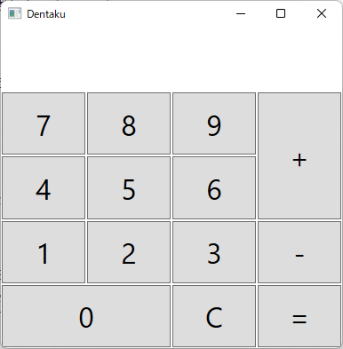

# C#で電卓を作成しよう

## ステップ1

Gridを用いてLabelとButtonを下の画像のように配置しましょう。

## ステップ２

数字ボタンをクリックして入力できるようにしましょう。

## ステップ３

Windowsの電卓を参考に、整数同士の足し算引き算 、ACを実装しましょう。

### ヒント1

Windowsの電卓を操作してみて、振る舞いを仕様書にまとめてみましょう。  
(数字、+、-、＝、C ボタンについて)  

###ヒント2

仕様書を参考に、電卓の状態遷移図・状態遷移表を作成してみましょう。

### ヒント3

状態遷移図・状態遷移表を元に実装してみましょう！

## Ex1．電卓をアップグレードしよう

### ステップ１

小数点ボタンを追加して、小数点の入力と表示に対応させましょう。

### ステップ２

正負切り替え(＋/－)を実装してみましょう。

### ステップ３

掛け算、割り算を実装してみましょう。